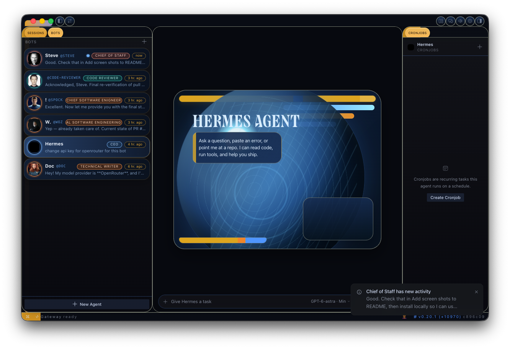
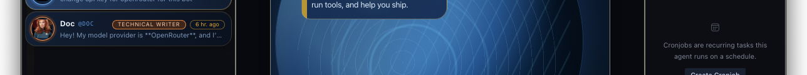

# Hermes Bot Mode

A **desktop-app plugin** for [Hermes Agent](https://github.com/NousResearch/hermes-agent) (installs where the desktop app runs — see Install) that turns your agent profiles into a roster of named bots — each with its own chat, avatar, personality, and schedule.

 


## What you get

- **Bots pane** — a left-side roster with one row per agent profile: avatar, latest-message preview, and timestamp. Click a bot to land in its chat.
- **New Agent** — create a bot in seconds: name, title, description. An **Advanced** disclosure opens the full profile config: clone from an existing profile, pin a provider/model, write a custom SOUL.md, skip bundled skills.
- **Edit Profile** (right-click a bot) — change the avatar, title, and description any time; its own Advanced section edits the live profile: per-skill and per-toolset enablement, model pin, and the full SOUL.md.
- **Duplicate** (right-click) — full clone of a bot: config, skills, SOUL.md, memory, and its look.
- **Avatars** — cute geometric faces (7 shapes × 10 colors with blinking eyes that scan while the bot works), an uploaded image, an AI-generated portrait (when an image backend is configured), or a pixel **pet** companion that bounces beside the avatar while the bot is busy.
- **Routines pane** — recurring tasks per bot, backed by Hermes cron. "Summarize my inbox every morning" lives next to the bot that does it. Runs land in the bot's own chat history.
- **Bot-to-bot messaging** — every bot has a persistent **Agent Inbox** conversation. Bots message each other with attribution (`[Message from agent 'researcher']`), and their SOUL.md teaches them the protocol, including how to reply.
- **@mentions** — type `@researcher have a look at this` in any chat and the active bot hands the message off, waits for the reply, and reports back.

## How it works

A bot **is** a Hermes profile — isolated config, memory, skills, credentials, and chat history under `~/.hermes/profiles/<name>/`. This plugin is a UI over that primitive:

- Chats open via cross-profile session navigation.
- Creation/editing rides the `profiles.*` gateway RPCs (`list`, `create`, `describe`, `configure`).
- Avatar generation uses the `image.generate` RPC and works over both local and remote gateways (results return as data URLs).
- Routines are plain Hermes cron jobs namespaced `[bot:<name>] <routine>` — they also show up in `hermes cron list` and the core Cron page.
- Bot-to-bot messages are real CLI handoffs: `hermes -p <bot> chat -c "Agent Inbox" -q "..."`.

No core patches, no background daemons, no extra storage: everything is standard Hermes surface.

## Screenshots

### LCARS Bot Mode shell

Opaque LCARS tabs, left-side bot roster pills, and the docked Cronjobs pane:



Focused crop of the Sessions / Bots / Cronjobs tab chrome:



### New Agent


### PetDex avatars


### Agent 2 Agent Communications


## Install

> **This is a desktop plugin** — it must be installed on the machine running the **Hermes desktop app**, not on the gateway. Desktop plugins load from the app-side `~/.hermes/desktop-plugins/` directory; if you use a remote/SSH gateway, installing on the gateway box does nothing. (Example: gateway on your homelab, desktop app on your MacBook → install on the MacBook.)

```bash
git clone https://github.com/NousResearch/Hermes-Bot-Mode ~/.hermes/desktop-plugins/hermes-bots
```

(or download `plugin.js` into `~/.hermes/desktop-plugins/hermes-bots/`)

Then reload plugins in the Hermes desktop app (Ctrl+K → "Reload desktop plugins") or restart the app. A **Bots** tab appears next to Sessions, and a **Routines** tile docks beside the conversation.

### Requirements

- Hermes desktop app with the plugin SDK (any recent build)
- The `profiles.*` / `image.generate` gateway RPCs ship in hermes-agent ≥ mid-2026 builds (`hermes update`). The plugin feature-detects older gateways and degrades gracefully — the roster works everywhere; Advanced editing and avatar generation light up when the RPCs exist.

## Notes

- Deleting a profile is intentionally not exposed in the UI; use `hermes profile delete <name>`.
- Bot-to-bot delivery is per-invocation (the receiving bot sees the message in its inbox when it next runs); live interrupt of a mid-conversation bot is upstream future work.
- Avatar/pet customizations are stored in plugin storage; the profile itself stays clean.

## License

MIT © Nous Research
